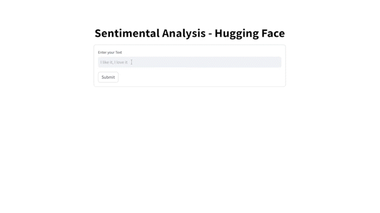

# Hugging Face - Sentiment Analysis
> Made as a side-project during the third year of the CY TECH Engineer Path

> Developped in September 2021. Edited in January 2021.

<br>

## I. Project Demonstration


<br>

## II. Description

### 1. What is Hugging Face?
Hugging Face is a leading natural language processing (NLP) platform that provides a wide array of tools, models, and resources for working with and advancing the field of natural language understanding. One of its notable contributions is the creation and curation of a vast library of pre-trained transformer models, which includes state-of-the-art models for various NLP tasks such as text generation, sentiment analysis, translation, and question-answering. The platform fosters collaboration and knowledge-sharing within the NLP community, offering accessible APIs and frameworks to empower developers and researchers in building innovative applications and pushing the boundaries of language AI.

### 2. What is Sentiment Analysis?
Sentiment Analysis, also known as opinion mining, is a subfield of natural language processing that involves the use of computational methods to determine and extract subjective information from text data. The primary goal of sentiment analysis is to assess and categorize the sentiment expressed in a piece of text, typically as positive, negative, or neutral. This analytical process employs machine learning algorithms and linguistic techniques to understand the emotional tone and subjective content of textual data, making it valuable for applications ranging from social media monitoring and customer feedback analysis to market research and brand perception evaluation. Sentiment analysis plays a crucial role in gaining insights into public opinion and sentiment trends across various domains, contributing to informed decision-making and improved user experiences.

<br>


## III. Project Structure

The structure of this repository is described below. It contains the source code of the project as well as the Dockerfile used to build the Docker Image.

```bash
.
├── Dockerfile
├── README.md
├── app.py
├── requirements.txt
└── src
    ├── config.py
    └── utils.py
```

<br>

## IV. Project Description

The purpose of this project is to demonstrate the use of their API to perform Sentiment Analysis on a given text. To perform such analysis, we use the DistilBERT model, which is a smaller version of the BERT model. This model give us the probability of the text to be positive, neutral or negative.

To realize this project, we used the following tools.
- Streamlit
- Docker

<br>

## V. Local Deployment

The local deployment is based on Docker. Thus, to correctly launch our interface, the [Docker](https://www.docker.com/) software must be installed. The deployment is relatively easy since it consists of the three steps described below.

#### **1° - Clone the Repository**
Firstly, you must clone this repository. To do so, you can use the following command.
```bash
git clone https://github.com/dorian-roux/HuggingFace-SentimentAnalysis
```

#### **2° - Obtain the Access Token**
Secondly, you must generate your Hugging Face Token. To do so, you need to register in their [website](https://huggingface.co/). Then you need to find the [Token Settings](https://huggingface.co/settings/tokens) and create a **New User Access Tokens**

#### **3° - Create the Configuration File**
Thirdly, you need to create the configuration file `config.py` in the `src` folder. To do so, you can paste and replace the following content.
```bash
API_URL = "https://api-inference.huggingface.co/models/lxyuan/distilbert-base-multilingual-cased-sentiments-student"
API_TOKEN = "{YOUR_ACCESS_TOKEN}"
```

#### **4° - Build the Docker Image**
Fourthly, you need to build the Docker Image based on this repository Dockerfile. To do so, you can use the following command.
```bash
docker build -t {TAG} .
```
<u>Note:</u> &nbsp; `{TAG}` is the name you want to give to your Docker Image. It is used to identify it later.


#### **5° - Run the Docker Container**
Finally, you need to run the Docker Container based on the Docker Image you just built. To do so, you can use the following command.
```bash
docker run -p 8501:8501 {TAG}
```
<u>Note:</u> &nbsp; We defined the port `8501` as the port used by the Streamlit Interface. Thus, you can access it by typing `localhost:8501` in your browser.
